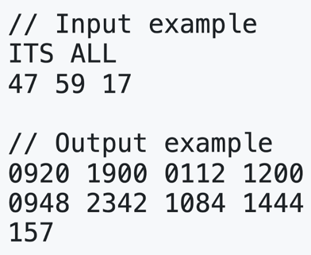

# 알고리즘 수업 자료 - RSA로 문장을 암호화하는 프로그램

- 링크: 수업 pdf 자료

---

📌 문제
-

	•	한 글자씩 두 자리 숫자로 바꾼다.
	•	공백 = 00
	•	A = 01, B = 02, …, Z = 26
	•	두 글자마다 하나의 블록으로 묶는다.
	•	예: "HI" → H = 08, I = 09 → 블록: 0809
	•	글자 수가 홀수면 마지막에 공백(00)을 패딩해서 두 글자를 맞춰도 됨.
	•	이렇게 만들어진 4자리 숫자를 M이라고 하고,
	•	n = p \times q
	•	각 블록마다 C = M^e \bmod n 을 계산해서 암호문 블록을 만든다.
	•	\varphi(n) = (p-1)(q-1) 에 대해
e \cdot d \equiv 1 \pmod{\varphi(n)} 을 만족하는 d (모듈러 역원)도 구한다.

---

⏬ 입력
-
	1.	첫째 줄
	•	암호화할 문장 S
	•	알파벳과 공백으로 이루어진 문장이라고 보면 돼.
	•	프로그램 안에서는 보통 전부 대문자로 바꾸고, 공백도 그대로 사용.
	2.	둘째 줄
	•	세 개의 정수 p q e
	•	한 줄에 공백으로 구분해서 주어진다.
	•	여기서
	•	p, q : 서로 다른 소수
	•	e : 공개키 지수

---

⏫ 출력
-
	1.	첫째 줄 – encoded message
	•	위의 규칙으로 만든 평문 숫자 블록 M 들을 출력
	•	각 블록을 공백 한 칸으로 구분
	•	예: 0809 1900 0126 ...
	2.	둘째 줄 – enciphered message
	•	각 블록에 대해 계산한 암호문 C = M^e mod n 들을 같은 순서로 출력
	•	역시 블록 사이를 공백 한 칸으로 구분
	•	예: 205 17 308 ...
	3.	셋째 줄 – d
	•	(p-1)(q-1)에 대한 e의 모듈러 역원 d 하나의 정수를 출력
---

📝 메모
-

- 실수했던 부분 / 주의할 점:
- 다시 풀 때 볼 것: